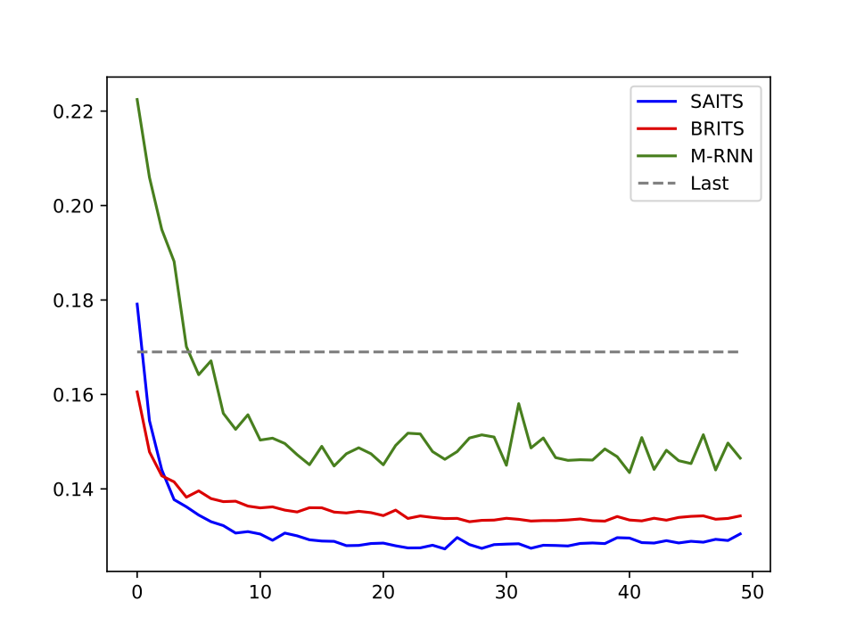
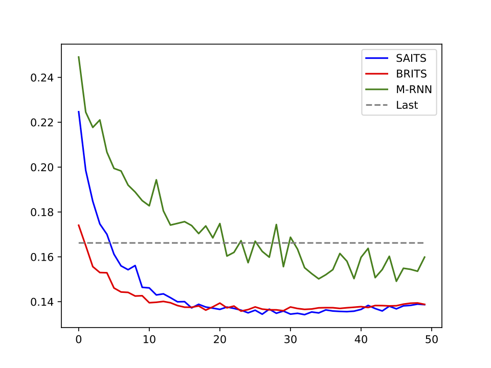
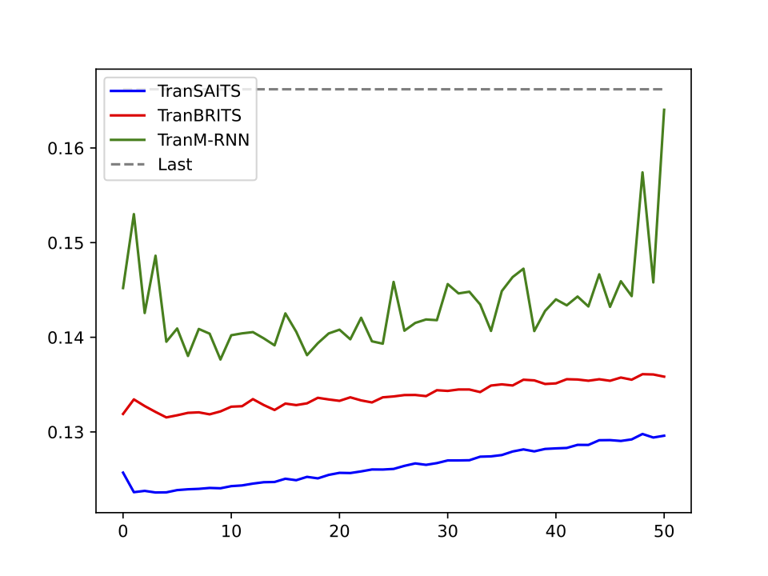

# Data Imputation ICU

The main objective of this project is to evaluate and meta-analyze state-of-the-art Data Imputation methods on Clinical Time Series Data from patients' ICU stays provided by an open access dataset (MIMIC-III) and doing an transfer learning approach to improve the models performance on an subset of these ICU stays, the ICU stays of cardiovascular patients. 
For this, we evaluate the machine learning imputation models M-RNN, BRITS and SAITS together with Zero-, Mean-, Median- and Last-Imputation as baseline methods.
We first evaluate all these models in an normal training approach on both all ICU and cardiovascular ICU data and afterwards use the models trained on all ICU data as a starting point
for the transfer learning approach and finetune these models on the cardiovascular dataset, creating TranSAITS, TranBRITS and TranM-RNN, the transfer learning trained implementations of their respective machine learning models.
To ensure the validation of this approach, we made sure that there is no data leakage between the all ICU's training data and the cardiovascular ICU validation and test data.
We evaluate the models performances, by using the metrics mean absolute error (MAE), root mean squared error (RMSE) and mean relative error (MRE), but we lay the
most focus on MAE.
The training convergence of validation MAE is seen in the following figures:
Training convergence on all ICU data:

Training convergence on cardiovascular data:

Training convergence of transfer learning:

The models performances on the test set can be seen in the following table, as mean $\pm$ standard deviation of the metrics in the order MAE/MRE/RMSE for ten trained models each:

This experiment showed, that the transfer learning based implementations are superior to their normal trained implementation on the cardiovascular ICU dataset in terms of lowest MAE on the test set, without an noteworthy increase in training time in comparison to the training on all ICU data.
The [previously](https://www.sciencedirect.com/science/article/abs/pii/S0957417423001203?via%3Dihub) established order of performance of these model architectures is also recreated, as SAITS is superior to BRITS, which itself is superior to M-RNN.
Moreover, the impact of transfer learing based data imputation for a downstream classification task, prediction of readmission to ICU, will be quantified in the future.

Check out the repository of the [SAITS implementation](https://github.com/WenjieDu/SAITS), for some models implementation used here, and the papers to the [SAITS](https://www.sciencedirect.com/science/article/abs/pii/S0957417423001203?via%3Dihub), 
[BRITS](https://arxiv.org/abs/1805.10572) and [M-RNN](https://arxiv.org/abs/1711.08742) model architectures.

